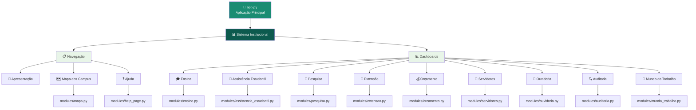
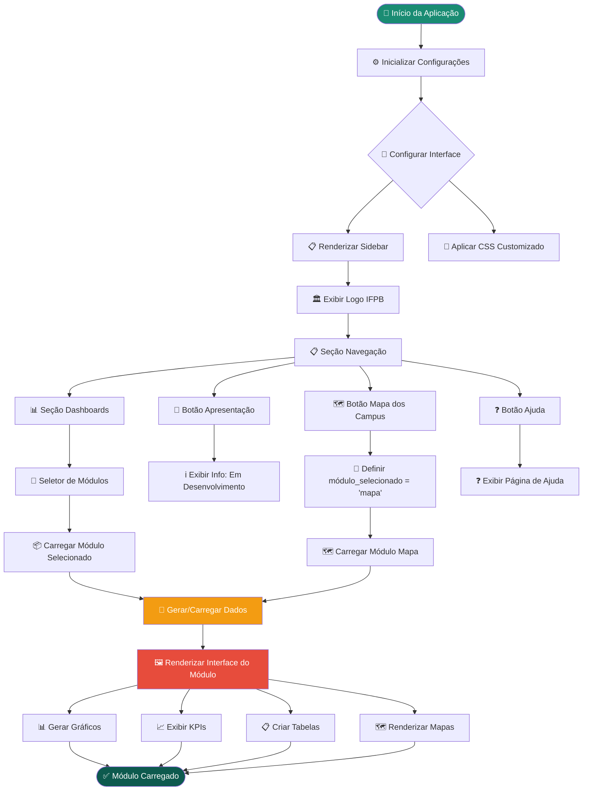
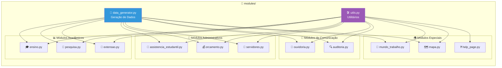
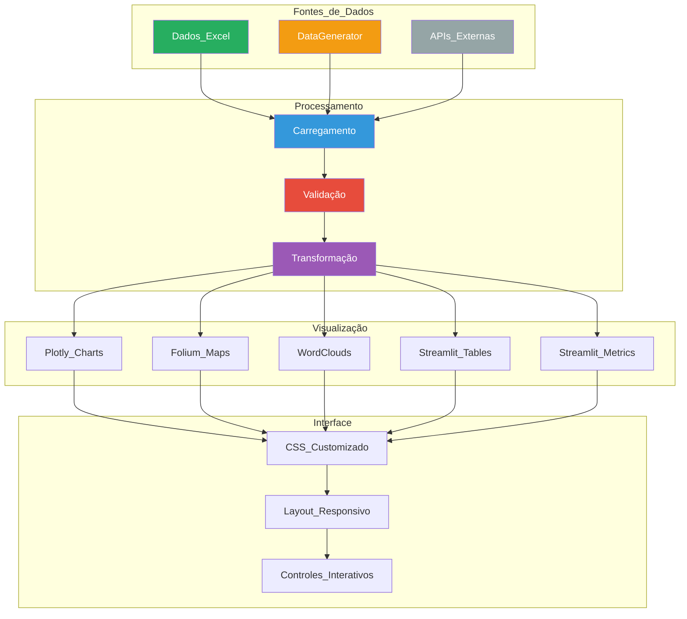
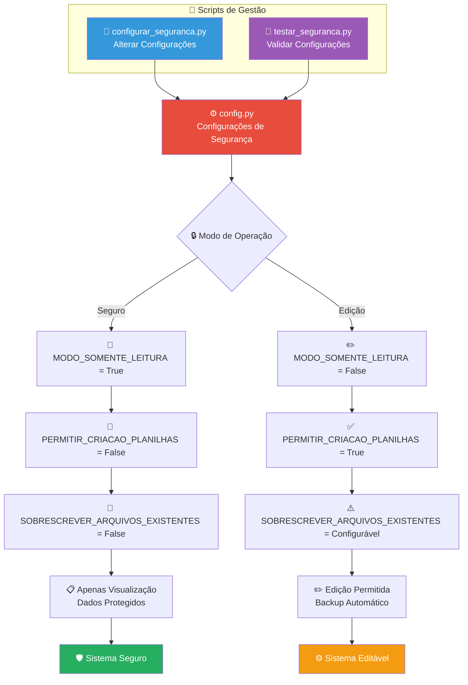
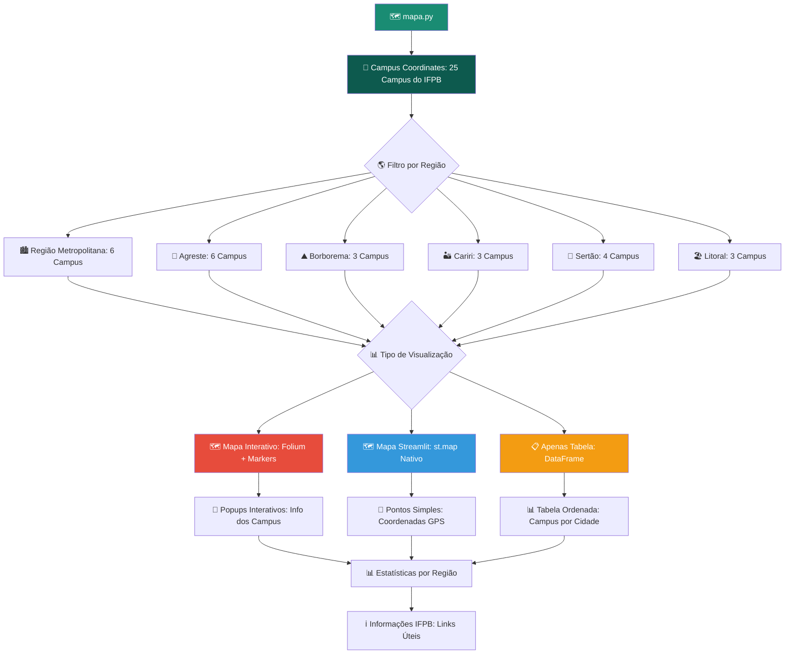
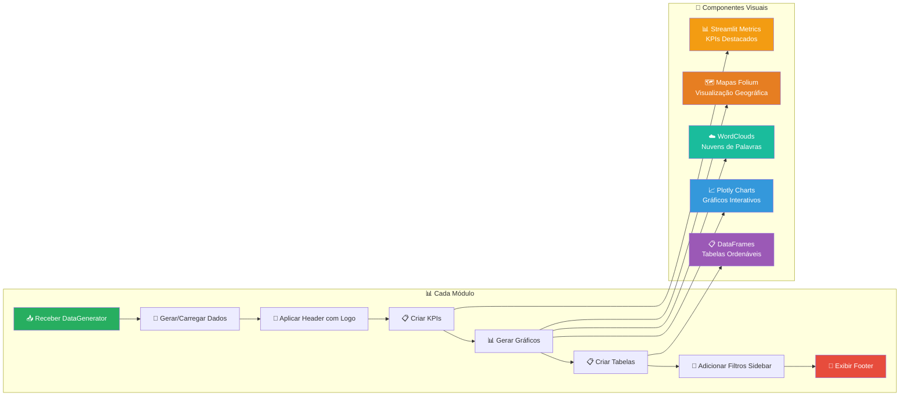
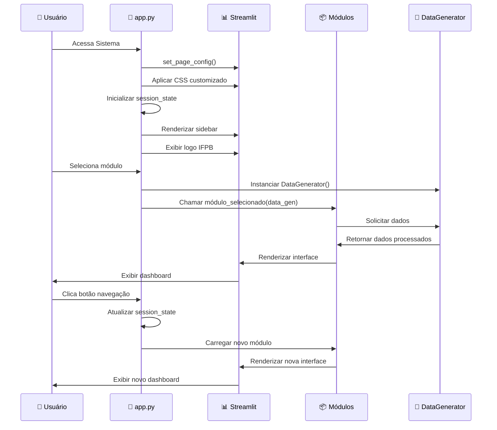

# 🗂️ Diagrama de Fluxo do Sistema - Dashboard IFPB-CZ

## 📋 Visão Geral do Sistema

O Sistema de Visualização de Dados Institucionais do IFPB Campus Cajazeiras é uma aplicação Streamlit que centraliza informações acadêmicas e administrativas em dashboards interativos.

### 📊 Sobre os Diagramas

Este documento contém dois tipos de representações para cada fluxo:

1. **🖼️ Imagens dos Diagramas**: Visualizações renderizadas dos fluxos (pasta `/fluxo/`)
2. **📝 Código Mermaid**: Código fonte dos diagramas para edição e customização

As imagens foram geradas usando o [Mermaid Chart](https://www.mermaidchart.com/) e fornecem uma visualização mais clara dos fluxos, enquanto o código Mermaid permite modificações e atualizações dos diagramas.

### 📑 Índice de Figuras

| Figura | Seção | Arquivo da Imagem |
|--------|-------|-------------------|
| 🏗️ Arquitetura Principal | [Arquitetura do Sistema](#%EF%B8%8F-arquitetura-do-sistema) | `IFPB-emnumeros-principal _ Mermaid Chart-2025-07-30-021728.png` |
| 🔄 Fluxo de Navegação | [Fluxo de Navegação](#-fluxo-de-navegação) | `IFPB-emnumeros-inicio-app _ Mermaid Chart-2025-07-30-022333.png` |
| 🗂️ Estrutura de Módulos | [Estrutura de Módulos](#%EF%B8%8F-estrutura-de-módulos) | `modules _ Mermaid Chart-2025-07-30-022504.png` |
| 📊 Fluxo de Dados | [Fluxo de Dados](#-fluxo-de-dados) | `Fontes-dados_ Mermaid Chart-2025-07-30-022700.png` |
| 🔐 Sistema de Segurança | [Sistema de Segurança](#-sistema-de-segurança) | `segurança_ Mermaid Chart-2025-07-30-022836.png` |
| 🗺️ Módulo Mapa | [Módulo Mapa Detalhado](#%EF%B8%8F-módulo-mapa-detalhado) | `mapa_ Mermaid Chart-2025-07-30-023010.png` |
| 📈 Pipeline de Visualização | [Pipeline de Visualização](#-pipeline-de-visualização) | `pipeline de visualização Mermaid Chart-2025-07-30-023245.png` |
| 🚀 Fluxo de Inicialização | [Fluxo de Inicialização](#-fluxo-de-inicialização) | `fluxo-inicialização_ Mermaid Chart-2025-07-30-023415.png` |

---

## 🏗️ Arquitetura do Sistema




---

## 🔄 Fluxo de Navegação




---

## 🗂️ Estrutura de Módulos




---

## 📊 Fluxo de Dados




---

## 🔐 Sistema de Segurança




---

## 🗺️ Módulo Mapa Detalhado




---

## 📈 Pipeline de Visualização




---

## 🚀 Fluxo de Inicialização




---

## 📁 Estrutura de Arquivos

```
📁 ifpbcz-numeros/
├── 🚀 app.py                     # Aplicação principal
├── ⚙️ config.py                  # Configurações de segurança
├── 📋 requirements.txt           # Dependências Python
├── 📄 README.md                  # Documentação principal
├── 📜 configurar_seguranca.py    # Script gestão segurança
├── 🧪 testar_seguranca.py        # Script teste segurança
├── 📊 GUIA_ATUALIZACAO_DADOS.md  # Guia atualização dados
│
├── 📁 dados/                     # Planilhas Excel
│   ├── 📊 dados_ensino.xlsx
│   ├── 📊 dados_pesquisa.xlsx
│   ├── 📊 dados_extensao.xlsx
│   ├── 📊 dados_assistencia.xlsx
│   ├── 📊 dados_orcamento.xlsx
│   ├── 📊 dados_servidores.xlsx
│   ├── 📊 dados_ouvidoria.xlsx
│   ├── 📊 dados_auditoria.xlsx
│   └── 📊 dados_mundo_trabalho.xlsx
│
├── 📁 logo-ifpb/                 # Recursos visuais
│   ├── 🏛️ IFPB-cz.png
│   ├── 🎨 ifpb-logo.svg
│   ├── 🏛️ logo_campus.png
│   ├── 🎨 logomarca_nai_*.svg
│   └── 🖼️ NAI.jpg
│
├── 📁 modules/                   # Módulos do sistema
│   ├── 🔧 __init__.py
│   ├── 🔄 data_generator.py      # Geração/carregamento dados
│   ├── 🛠️ utils.py               # Funções utilitárias
│   ├── 🎓 ensino.py              # Módulo ensino
│   ├── 🤝 assistencia_estudantil.py # Módulo assistência
│   ├── 🔬 pesquisa.py            # Módulo pesquisa
│   ├── 🌟 extensao.py            # Módulo extensão
│   ├── 💰 orcamento.py           # Módulo orçamento
│   ├── 👥 servidores.py          # Módulo servidores
│   ├── 📢 ouvidoria.py           # Módulo ouvidoria
│   ├── 🔍 auditoria.py           # Módulo auditoria
│   ├── 💼 mundo_trabalho.py      # Módulo mundo trabalho
│   ├── 🗺️ mapa.py                # Módulo mapa campus
│   └── ❓ help_page.py           # Página de ajuda
│
└── 📁 docs/                      # Documentação
    └── 📋 diagrama_fluxo_sistema.md # Este arquivo
```

---

## 🔧 Tecnologias Utilizadas

- **🐍 Python 3.12+**: Linguagem principal
- **🚀 Streamlit**: Framework web para dashboards
- **📊 Plotly**: Gráficos interativos
- **🗺️ Folium**: Mapas interativos
- **📊 Pandas**: Manipulação de dados
- **📈 NumPy**: Computação numérica
- **☁️ WordCloud**: Nuvens de palavras
- **🎨 Matplotlib**: Gráficos estáticos
- **📄 OpenPyXL**: Leitura de arquivos Excel

---

## 🎯 Funcionalidades Principais

### 📊 **Dashboards Acadêmicos**
- 🎓 **Ensino**: Matrículas, cursos, desempenho acadêmico
- 🔬 **Pesquisa**: Projetos, publicações, produção científica
- 🌟 **Extensão**: Projetos de extensão, participação comunitária

### 👥 **Dashboards Administrativos**
- 🤝 **Assistência Estudantil**: Programas de apoio, benefícios
- 💰 **Orçamento**: Execução orçamentária, investimentos
- 👥 **Servidores**: Recursos humanos, capacitação

### 📢 **Dashboards de Gestão**
- 📢 **Ouvidoria**: Manifestações, atendimentos, satisfação
- 🔍 **Auditoria**: Conformidade, recomendações, melhorias
- 💼 **Mundo do Trabalho**: Empregabilidade, estágios, parcerias

### 🌍 **Funcionalidades Especiais**
- 🗺️ **Mapa dos Campus**: Localização geográfica dos 25 campus do IFPB
- 🔐 **Sistema de Segurança**: Controle de acesso e proteção de dados
- 📱 **Interface Responsiva**: Adaptável a diferentes dispositivos

---

*📅 Última atualização: 29 de julho de 2025*  
*🏛️ IFPB - Campus Cajazeiras*  
*👨‍💻 Sistema desenvolvido para visualização de dados institucionais*
