# 🗂️ Diagrama de Fluxo do Sistema - Dashboard IFPB-CZ

## 📋 Visão Geral do Sistema

O Sistema de Visualização de Dados Institucionais do IFPB Campus Cajazeiras é uma aplicação Streamlit que centraliza informações acadêmicas e administrativas em dashboards interativos.

---

## 🏗️ Arquitetura do Sistema

```mermaid
graph TD
    A[🚀 app.py<br/>Aplicação Principal] --> B[📊 Sistema Institucional]
    
    B --> C[📋 Navegação]
    B --> D[📊 Dashboards]
    
    C --> E[📖 Apresentação]
    C --> F[🗺️ Mapa dos Campus]
    C --> G[❓ Ajuda]
    
    D --> H[🎓 Ensino]
    D --> I[🤝 Assistência Estudantil]
    D --> J[🔬 Pesquisa]
    D --> K[🌟 Extensão]
    D --> L[💰 Orçamento]
    D --> M[👥 Servidores]
    D --> N[📢 Ouvidoria]
    D --> O[🔍 Auditoria]
    D --> P[💼 Mundo do Trabalho]
    
    F --> Q[modules/mapa.py]
    H --> R[modules/ensino.py]
    I --> S[modules/assistencia_estudantil.py]
    J --> T[modules/pesquisa.py]
    K --> U[modules/extensao.py]
    L --> V[modules/orcamento.py]
    M --> W[modules/servidores.py]
    N --> X[modules/ouvidoria.py]
    O --> Y[modules/auditoria.py]
    P --> Z[modules/mundo_trabalho.py]
    G --> AA[modules/help_page.py]
    
    style A fill:#1a8c73,color:#fff
    style B fill:#0d5a4e,color:#fff
    style C fill:#e8f5e8
    style D fill:#e8f5e8
```



---

## 🔄 Fluxo de Navegação

```mermaid
flowchart TD
    START([🌟 Início da Aplicação]) --> INIT[⚙️ Inicializar Configurações]
    
    INIT --> CONFIG{🔧 Configurar Interface}
    CONFIG --> SIDEBAR[📋 Renderizar Sidebar]
    CONFIG --> CSS[🎨 Aplicar CSS Customizado]
    
    SIDEBAR --> LOGO[🏛️ Exibir Logo IFPB]
    LOGO --> NAV[📋 Seção Navegação]
    NAV --> DASH[📊 Seção Dashboards]
    
    NAV --> BTN_APRES[📖 Botão Apresentação]
    NAV --> BTN_MAPA[🗺️ Botão Mapa dos Campus]
    NAV --> BTN_AJUDA[❓ Botão Ajuda]
    
    DASH --> SELECT[🔽 Seletor de Módulos]
    
    BTN_APRES --> INFO_APRES[ℹ️ Exibir Info: Em Desenvolvimento]
    BTN_MAPA --> SET_MAPA[📍 Definir módulo_selecionado = 'mapa']
    BTN_AJUDA --> SHOW_HELP[❓ Exibir Página de Ajuda]
    
    SET_MAPA --> LOAD_MAPA[🗺️ Carregar Módulo Mapa]
    SELECT --> LOAD_MODULE[📦 Carregar Módulo Selecionado]
    
    LOAD_MODULE --> DATA_GEN[🔄 Gerar/Carregar Dados]
    LOAD_MAPA --> DATA_GEN
    
    DATA_GEN --> RENDER[🖼️ Renderizar Interface do Módulo]
    
    RENDER --> CHARTS[📊 Gerar Gráficos]
    RENDER --> KPIS[📈 Exibir KPIs]
    RENDER --> TABLES[📋 Criar Tabelas]
    RENDER --> MAPS[🗺️ Renderizar Mapas (se aplicável)]
    
    CHARTS --> END([✅ Módulo Carregado])
    KPIS --> END
    TABLES --> END
    MAPS --> END
    
    style START fill:#1a8c73,color:#fff
    style END fill:#0d5a4e,color:#fff
    style DATA_GEN fill:#f39c12,color:#fff
    style RENDER fill:#e74c3c,color:#fff
```

---

## 🗂️ Estrutura de Módulos

```mermaid
graph LR
    subgraph "📁 modules/"
        A[🔧 data_generator.py<br/>Geração de Dados]
        B[🛠️ utils.py<br/>Utilitários]
        
        subgraph "📊 Módulos Acadêmicos"
            C[🎓 ensino.py]
            D[🔬 pesquisa.py]
            E[🌟 extensao.py]
        end
        
        subgraph "👥 Módulos Administrativos"
            F[🤝 assistencia_estudantil.py]
            G[💰 orcamento.py]
            H[👥 servidores.py]
        end
        
        subgraph "📢 Módulos de Comunicação"
            I[📢 ouvidoria.py]
            J[🔍 auditoria.py]
        end
        
        subgraph "🌍 Módulos Especiais"
            K[💼 mundo_trabalho.py]
            L[🗺️ mapa.py]
            M[❓ help_page.py]
        end
    end
    
    A --> C
    A --> D
    A --> E
    A --> F
    A --> G
    A --> H
    A --> I
    A --> J
    A --> K
    A --> L
    
    B --> C
    B --> D
    B --> E
    B --> F
    B --> G
    B --> H
    B --> I
    B --> J
    B --> K
    B --> L
    B --> M
    
    style A fill:#3498db,color:#fff
    style B fill:#9b59b6,color:#fff
```



---

## 📊 Fluxo de Dados

```mermaid
flowchart TD
    subgraph "💾 Fontes de Dados"
        A[📄 dados/*.xlsx<br/>Planilhas Excel]
        B[🔄 DataGenerator<br/>Dados Sintéticos]
        C[🌐 APIs Externas<br/>(Futuro)]
    end
    
    subgraph "⚙️ Processamento"
        D[📋 Carregamento<br/>load_data()]
        E[🔍 Validação<br/>validate_data()]
        F[🛠️ Transformação<br/>transform_data()]
    end
    
    subgraph "📊 Visualização"
        G[📈 Plotly Charts]
        H[🗺️ Folium Maps]
        I[☁️ WordClouds]
        J[📋 Streamlit Tables]
        K[📊 Streamlit Metrics]
    end
    
    subgraph "🖥️ Interface"
        L[🎨 CSS Customizado]
        M[📱 Layout Responsivo]
        N[🔧 Controles Interativos]
    end
    
    A --> D
    B --> D
    C --> D
    
    D --> E
    E --> F
    
    F --> G
    F --> H
    F --> I
    F --> J
    F --> K
    
    G --> L
    H --> L
    I --> L
    J --> L
    K --> L
    
    L --> M
    M --> N
    
    style A fill:#27ae60,color:#fff
    style B fill:#f39c12,color:#fff
    style C fill:#95a5a6,color:#fff
    style D fill:#3498db,color:#fff
    style E fill:#e74c3c,color:#fff
    style F fill:#9b59b6,color:#fff
```

---

## 🔐 Sistema de Segurança

```mermaid
flowchart TD
    A[⚙️ config.py<br/>Configurações de Segurança] --> B{🔒 Modo de Operação}
    
    B -->|Seguro| C[📖 MODO_SOMENTE_LEITURA = True]
    B -->|Edição| D[✏️ MODO_SOMENTE_LEITURA = False]
    
    C --> E[🚫 PERMITIR_CRIACAO_PLANILHAS = False]
    D --> F[✅ PERMITIR_CRIACAO_PLANILHAS = True]
    
    E --> G[🚫 SOBRESCREVER_ARQUIVOS_EXISTENTES = False]
    F --> H[⚠️ SOBRESCREVER_ARQUIVOS_EXISTENTES = Configurável]
    
    G --> I[📋 Apenas Visualização<br/>Dados Protegidos]
    H --> J[✏️ Edição Permitida<br/>Backup Automático]
    
    I --> K[🛡️ Sistema Seguro]
    J --> L[⚙️ Sistema Editável]
    
    subgraph "🔧 Scripts de Gestão"
        M[📜 configurar_seguranca.py<br/>Alterar Configurações]
        N[🧪 testar_seguranca.py<br/>Validar Configurações]
    end
    
    M --> A
    N --> A
    
    style A fill:#e74c3c,color:#fff
    style K fill:#27ae60,color:#fff
    style L fill:#f39c12,color:#fff
    style M fill:#3498db,color:#fff
    style N fill:#9b59b6,color:#fff
```



---

## 🗺️ Módulo Mapa Detalhado

```mermaid
flowchart TD
    A[🗺️ mapa.py] --> B[📍 Campus Coordinates<br/>25 Campus do IFPB]
    
    B --> C{🌎 Filtro por Região}
    
    C --> D[🏙️ Região Metropolitana<br/>6 Campus]
    C --> E[🌾 Agreste<br/>6 Campus]
    C --> F[⛰️ Borborema<br/>3 Campus]
    C --> G[🏜️ Cariri<br/>3 Campus]
    C --> H[🌵 Sertão<br/>4 Campus]
    C --> I[🏖️ Litoral<br/>3 Campus]
    
    D --> J{📊 Tipo de Visualização}
    E --> J
    F --> J
    G --> J
    H --> J
    I --> J
    
    J --> K[🗺️ Mapa Interativo<br/>Folium + Markers]
    J --> L[🗺️ Mapa Streamlit<br/>st.map() Nativo]
    J --> M[📋 Apenas Tabela<br/>DataFrame]
    
    K --> N[🎯 Popups Interativos<br/>Info dos Campus]
    L --> O[📍 Pontos Simples<br/>Coordenadas GPS]
    M --> P[📊 Tabela Ordenada<br/>Campus por Cidade]
    
    N --> Q[📊 Estatísticas por Região]
    O --> Q
    P --> Q
    
    Q --> R[ℹ️ Informações IFPB<br/>Links Úteis]
    
    style A fill:#1a8c73,color:#fff
    style B fill:#0d5a4e,color:#fff
    style K fill:#e74c3c,color:#fff
    style L fill:#3498db,color:#fff
    style M fill:#f39c12,color:#fff
```

---

## 📈 Pipeline de Visualização

```mermaid
flowchart LR
    subgraph "📊 Cada Módulo"
        A[📥 Receber DataGenerator] --> B[🔄 Gerar/Carregar Dados]
        B --> C[🎨 Aplicar Header com Logo]
        C --> D[📋 Criar KPIs]
        D --> E[📊 Gerar Gráficos]
        E --> F[📋 Criar Tabelas]
        F --> G[🔧 Adicionar Filtros Sidebar]
        G --> H[📄 Exibir Footer]
    end
    
    subgraph "🎨 Componentes Visuais"
        I[📈 Plotly Charts<br/>Gráficos Interativos]
        J[📊 Streamlit Metrics<br/>KPIs Destacados]
        K[📋 DataFrames<br/>Tabelas Ordenáveis]
        L[☁️ WordClouds<br/>Nuvens de Palavras]
        M[🗺️ Mapas Folium<br/>Visualização Geográfica]
    end
    
    E --> I
    D --> J
    F --> K
    E --> L
    E --> M
    
    style A fill:#27ae60,color:#fff
    style H fill:#e74c3c,color:#fff
    style I fill:#3498db,color:#fff
    style J fill:#f39c12,color:#fff
    style K fill:#9b59b6,color:#fff
    style L fill:#1abc9c,color:#fff
    style M fill:#e67e22,color:#fff
```



---

## 🚀 Fluxo de Inicialização

```mermaid
sequenceDiagram
    participant U as 👤 Usuário
    participant A as 🚀 app.py
    participant S as 📊 Streamlit
    participant M as 📦 Módulos
    participant D as 💾 DataGenerator
    
    U->>A: Acessa Sistema
    A->>S: set_page_config()
    A->>S: Aplicar CSS customizado
    A->>A: Inicializar session_state
    A->>S: Renderizar sidebar
    A->>S: Exibir logo IFPB
    
    U->>A: Seleciona módulo
    A->>D: Instanciar DataGenerator()
    A->>M: Chamar módulo_selecionado(data_gen)
    M->>D: Solicitar dados
    D->>M: Retornar dados processados
    M->>S: Renderizar interface
    S->>U: Exibir dashboard
    
    U->>A: Clica botão navegação
    A->>A: Atualizar session_state
    A->>M: Carregar novo módulo
    M->>S: Renderizar nova interface
    S->>U: Exibir novo dashboard
```



---

## 📁 Estrutura de Arquivos

```
📁 ifpbcz-numeros/
├── 🚀 app.py                     # Aplicação principal
├── ⚙️ config.py                  # Configurações de segurança
├── 📋 requirements.txt           # Dependências Python
├── 📄 README.md                  # Documentação principal
├── 📜 configurar_seguranca.py    # Script gestão segurança
├── 🧪 testar_seguranca.py        # Script teste segurança
├── 📊 GUIA_ATUALIZACAO_DADOS.md  # Guia atualização dados
│
├── 📁 dados/                     # Planilhas Excel
│   ├── 📊 dados_ensino.xlsx
│   ├── 📊 dados_pesquisa.xlsx
│   ├── 📊 dados_extensao.xlsx
│   ├── 📊 dados_assistencia.xlsx
│   ├── 📊 dados_orcamento.xlsx
│   ├── 📊 dados_servidores.xlsx
│   ├── 📊 dados_ouvidoria.xlsx
│   ├── 📊 dados_auditoria.xlsx
│   └── 📊 dados_mundo_trabalho.xlsx
│
├── 📁 logo-ifpb/                 # Recursos visuais
│   ├── 🏛️ IFPB-cz.png
│   ├── 🎨 ifpb-logo.svg
│   ├── 🏛️ logo_campus.png
│   ├── 🎨 logomarca_nai_*.svg
│   └── 🖼️ NAI.jpg
│
├── 📁 modules/                   # Módulos do sistema
│   ├── 🔧 __init__.py
│   ├── 🔄 data_generator.py      # Geração/carregamento dados
│   ├── 🛠️ utils.py               # Funções utilitárias
│   ├── 🎓 ensino.py              # Módulo ensino
│   ├── 🤝 assistencia_estudantil.py # Módulo assistência
│   ├── 🔬 pesquisa.py            # Módulo pesquisa
│   ├── 🌟 extensao.py            # Módulo extensão
│   ├── 💰 orcamento.py           # Módulo orçamento
│   ├── 👥 servidores.py          # Módulo servidores
│   ├── 📢 ouvidoria.py           # Módulo ouvidoria
│   ├── 🔍 auditoria.py           # Módulo auditoria
│   ├── 💼 mundo_trabalho.py      # Módulo mundo trabalho
│   ├── 🗺️ mapa.py                # Módulo mapa campus
│   └── ❓ help_page.py           # Página de ajuda
│
└── 📁 docs/                      # Documentação
    └── 📋 diagrama_fluxo_sistema.md # Este arquivo
```

---

## 🔧 Tecnologias Utilizadas

- **🐍 Python 3.12+**: Linguagem principal
- **🚀 Streamlit**: Framework web para dashboards
- **📊 Plotly**: Gráficos interativos
- **🗺️ Folium**: Mapas interativos
- **📊 Pandas**: Manipulação de dados
- **📈 NumPy**: Computação numérica
- **☁️ WordCloud**: Nuvens de palavras
- **🎨 Matplotlib**: Gráficos estáticos
- **📄 OpenPyXL**: Leitura de arquivos Excel

---

## 🎯 Funcionalidades Principais

### 📊 **Dashboards Acadêmicos**
- 🎓 **Ensino**: Matrículas, cursos, desempenho acadêmico
- 🔬 **Pesquisa**: Projetos, publicações, produção científica
- 🌟 **Extensão**: Projetos de extensão, participação comunitária

### 👥 **Dashboards Administrativos**
- 🤝 **Assistência Estudantil**: Programas de apoio, benefícios
- 💰 **Orçamento**: Execução orçamentária, investimentos
- 👥 **Servidores**: Recursos humanos, capacitação

### 📢 **Dashboards de Gestão**
- 📢 **Ouvidoria**: Manifestações, atendimentos, satisfação
- 🔍 **Auditoria**: Conformidade, recomendações, melhorias
- 💼 **Mundo do Trabalho**: Empregabilidade, estágios, parcerias

### 🌍 **Funcionalidades Especiais**
- 🗺️ **Mapa dos Campus**: Localização geográfica dos 25 campus do IFPB
- 🔐 **Sistema de Segurança**: Controle de acesso e proteção de dados
- 📱 **Interface Responsiva**: Adaptável a diferentes dispositivos

---

*📅 Última atualização: 17 de julho de 2025*  
*🏛️ IFPB - Campus Cajazeiras*  
*👨‍💻 Sistema desenvolvido para visualização de dados institucionais*
